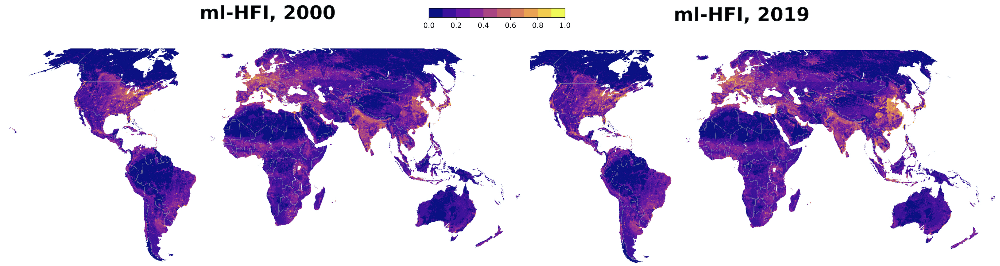
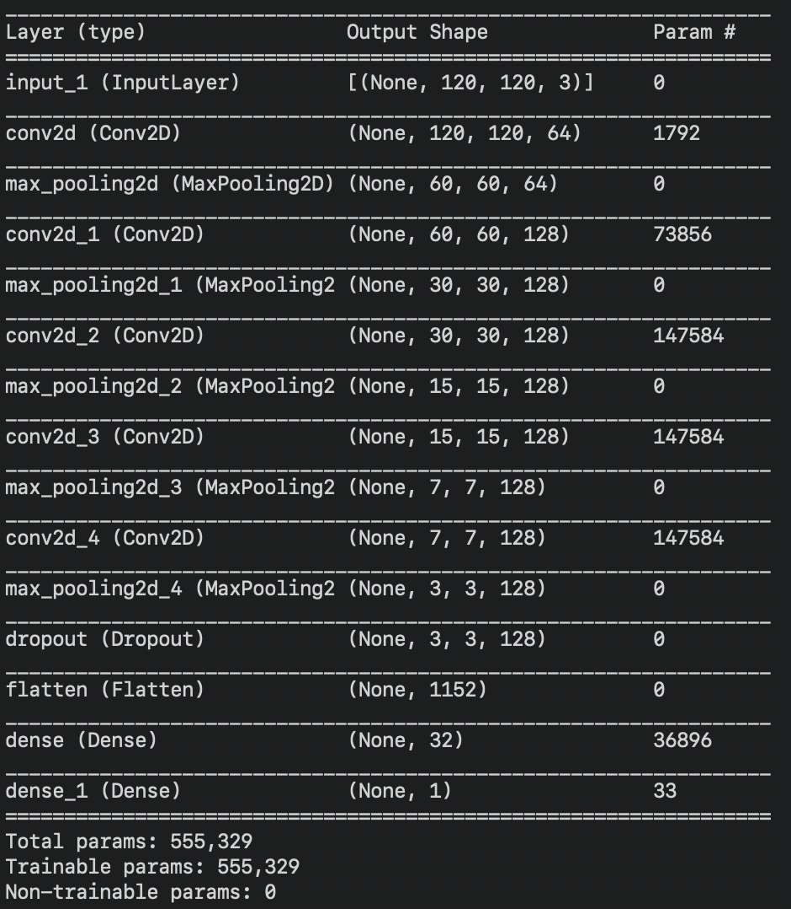

## ml-HFI
The machine-learning-based human footprint index (ml-HFI) is an index of human pressure on the landscape based on remotely sensed surface imagery. 

## Motivation
Governments worldwide have poured massive capital into strategies for conserving biodiversity while also meeting the resource needs of their populations. However, the pace and scale of human development has exceeded our ability to monitor human influence on Earth's surface, creating a major challenge to sustainable development. The ml-HFI addresses this problem directly as a near-real-time index that quantifies human pressure on the landscape globally based only on freely available Landsat imagery. Specifically, the ml-HFI is computed via an interpretable convolutional neural network which converts global, remote sensing imagery into a metric of the human footprint on the landscape.

## Version status
The latest version of the ml-HFI is v1.0. Future versions will be released here.

## Get the data

The ml-HFI is a continuous value between 0. and 1., ranging from no human impact to high human impact. ml-HFI v1.0 contains a global map of the ml-HFI for the year 2000 and the year 2019 on a 0.00989 deg latitude x 0.00989 deg longitude grid running from 70S-70N. Data for each year can be accessed below via netcdf (.nc) files. Each file is 3.6GB in size.

* ml-HFI 2000: ml_hfi_v1_2000.nc
* ml-HFI 2019: ml_hfi_v1_2019.nc

## Algorithm
We train a convolutional neural network (architecture shown in the image) to ingest three channels of Landsat imagery and predict the human footprint index for that location. 

<figure>
    
    <figcaption>Figure 2: CNN architecture used for training each region.</figcaption>
</figure>    
  
For training, we utilize the gridded HFI product computed by Williams et al. (2020) for the year 2000. The Williams et al. (2020) HFI is comprised of eight different sub indices representing different aspects of human pressures to the terrestrial surface of the Earth, including 1) extent of the built environment, 2) population density, 3) electric infrastructure, 4) agricultural lands, 5) pasture lands, 6) roadways, 7) railways, and 8) navigable waterways. Continental regions were trained separately and then the final predictions for each continetal region were combined to create a final, single ml-HFI product. 
  
The grid resolution of the Williams et al. (2020) training data and the ml-HFI product is 0.00989 deg latitude x 0.00989 deg longitude, and the ml-HFI is computed from 70S-70N. The ml-HFI algorithm was coded with python 3.6 and run on the Walter Scott College of Engineering HPC "Asha". 

A detailed description of the ml-HFI and its computation is provided in Keys et al. (2020).

## Credits
The ml-HFI was conceived and created as a collaborative effort between [Dr. Elizabeth A. Barnes](https://sites.google.com/rams.colostate.edu/barnesresearchgroup/home), [Dr. Patrick W. Keys](patkeys.com) and [Dr. Neil Carter](https://seas.umich.edu/research/faculty/neil-carter).

#### Funding sources
This work was funded, in part, by the United States National Aeronautics and Space Administration (NASA) under grant 18-SLSCVC18-0006.

#### References
* Williams, B. A., and Coauthors, 2020: Change in terrestrial human footprint drives continued loss of intact ecosystems. 2020.05.04.077818, https://doi.org/10.1101/2020.05.04.077818
* Keys, Patrick, Elizabeth A. Barnes and Neil Carter: A machine-learning approach to human footprint index estimation with applications to sustainable development. Revisions submitted to _Environmental Research Letters_, 10/2020.

## License
This project is licensed under an MIT license.

MIT © [Elizabeth A. Barnes]()

